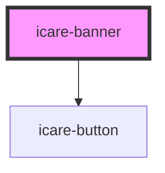

# icare-banner

<!-- Auto Generated Below -->

## Properties

| Property | Attribute | Description | Type     | Default     |
| -------- | --------- | ----------- | -------- | ----------- |
| `imgAlt` | `img-alt` |             | `string` | `undefined` |
| `imgSrc` | `img-src` |             | `string` | `undefined` |

## Dependencies

### Depends on

- [icare-button](../icare-button)

### Graph

----------------------------------------------

*Built with [StencilJS](https://stenciljs.com/)*
