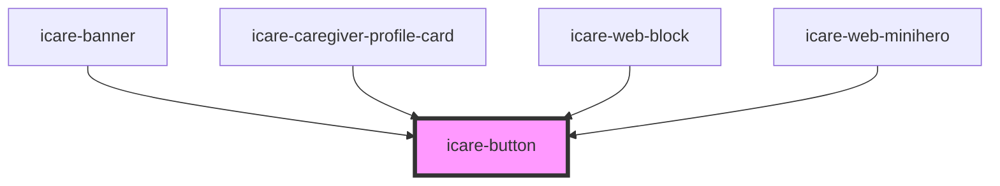

# icare-button

<!-- Auto Generated Below -->

## Properties

| Property  | Attribute | Description                                              | Type                              | Default     |
| --------- | --------- | -------------------------------------------------------- | --------------------------------- | ----------- |
| `form`    | `form`    | Form association (for submit/reset outside the form)     | `string`                          | `undefined` |
| `href`    | `href`    | Optional navigation URL                                  | `string`                          | `undefined` |
| `label`   | `label`   | Button text or fallback when no slot content is provided | `string`                          | `"Click"`   |
| `size`    | `size`    | Size of the button                                       | `"large" \| "medium" \| "small"`  | `"medium"`  |
| `target`  | `target`  | Link target (only relevant if href is provided)          | `"_blank" \| "_self"`             | `"_self"`   |
| `type`    | `type`    | Button type                                              | `"button" \| "reset" \| "submit"` | `"button"`  |
| `variant` | `variant` | Visual style                                             | `"primary" \| "secondary"`        | `"primary"` |

## Events

| Event         | Description                          | Type                |
| ------------- | ------------------------------------ | ------------------- |
| `buttonClick` | Emits whenever the button is clicked | `CustomEvent<void>` |

## Dependencies

### Used by

 - [icare-banner](../icare-banner)
 - [icare-caregiver-profile-card](../icare-caregiver-profile-card)
 - [icare-web-block](../icare-web-block)
 - [icare-web-minihero](../icare-web-minihero)

### Graph

----------------------------------------------

*Built with [StencilJS](https://stenciljs.com/)*
