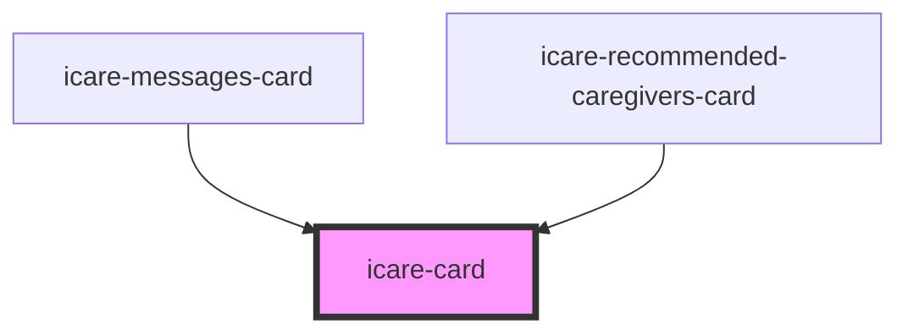

# icare-card

<!-- Auto Generated Below -->

## Properties

| Property      | Attribute     | Description | Type                       | Default      |
| ------------- | ------------- | ----------- | -------------------------- | ------------ |
| `interactive` | `interactive` |             | `boolean`                  | `false`      |
| `variant`     | `variant`     |             | `"elevated" \| "outlined"` | `"outlined"` |

## Dependencies

### Used by

 - [icare-messages-card](../icare-messages-card)
 - [icare-recommended-caregivers-card](../icare-recommended-caregivers-card)

### Graph

----------------------------------------------

*Built with [StencilJS](https://stenciljs.com/)*
