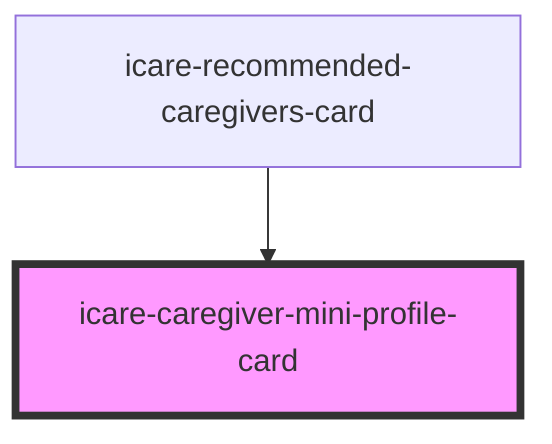

# icare-caregiver-mini-profile-card

<!-- Auto Generated Below -->

## Properties

| Property | Attribute | Description | Type     | Default     |
| -------- | --------- | ----------- | -------- | ----------- |
| `bio`    | `bio`     |             | `string` | `undefined` |
| `imgAlt` | `img-alt` |             | `string` | `undefined` |
| `imgSrc` | `img-src` |             | `string` | `undefined` |
| `name`   | `name`    |             | `string` | `undefined` |

## Dependencies

### Used by

 - [icare-recommended-caregivers-card](../icare-recommended-caregivers-card)

### Graph

----------------------------------------------

*Built with [StencilJS](https://stenciljs.com/)*
