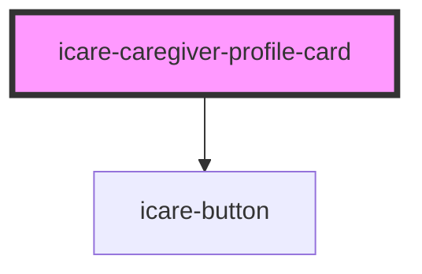

# icare-caregiver-profile-card

<!-- Auto Generated Below -->

## Properties

| Property      | Attribute     | Description | Type       | Default     |
| ------------- | ------------- | ----------- | ---------- | ----------- |
| `cardTitle`   | `card-title`  |             | `string`   | `undefined` |
| `description` | `description` |             | `string`   | `undefined` |
| `features`    | `features`    |             | `string[]` | `[]`        |
| `imageAlt`    | `image-alt`   |             | `string`   | `undefined` |
| `imageSrc`    | `image-src`   |             | `string`   | `undefined` |
| `shortBio`    | `short-bio`   |             | `string`   | `undefined` |

## Dependencies

### Depends on

- [icare-button](../icare-button)

### Graph

----------------------------------------------

*Built with [StencilJS](https://stenciljs.com/)*
