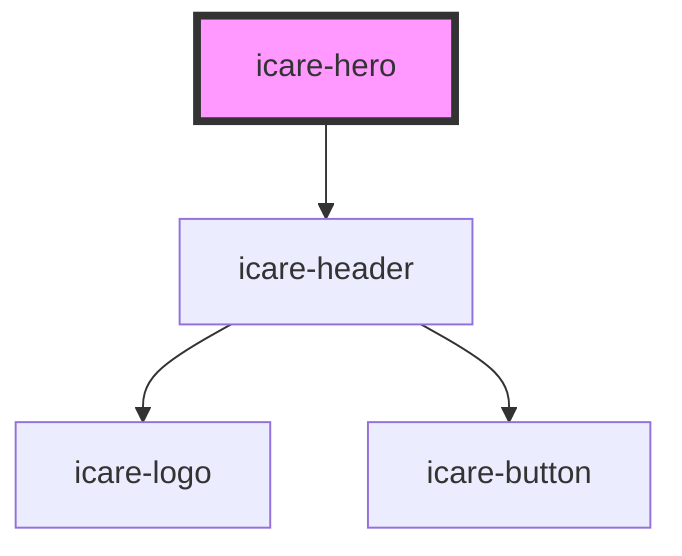

# icare-hero

<!-- Auto Generated Below -->

## Properties

| Property          | Attribute          | Description                                 | Type                            | Default                                |
| ----------------- | ------------------ | ------------------------------------------- | ------------------------------- | -------------------------------------- |
| `imageAlt`        | `image-alt`        | Alt text for accessibility                  | `string`                        | `'iCare hero image'`                   |
| `imageSrc`        | `image-src`        | Background hero image source                | `string`                        | `'images/heros/hero-landing-page.jpg'` |
| `overlayPosition` | `overlay-position` | Overlay position: 'top', 'center', 'bottom' | `"bottom" \| "center" \| "top"` | `'center'`                             |

## Dependencies

### Depends on

- [icare-header](../icare-header)

### Graph

----------------------------------------------

*Built with [StencilJS](https://stenciljs.com/)*
