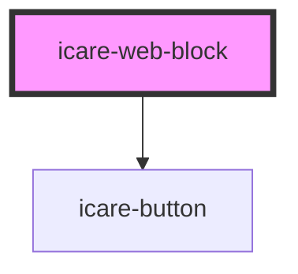

# icare-web-block

<!-- Auto Generated Below -->

## Properties

| Property | Attribute | Description | Type                                                         | Default       |
| -------- | --------- | ----------- | ------------------------------------------------------------ | ------------- |
| `imgAlt` | `img-alt` |             | `string`                                                     | `undefined`   |
| `imgSrc` | `img-src` |             | `string`                                                     | `undefined`   |
| `layout` | `layout`  |             | `"text-bottom" \| "text-left" \| "text-right" \| "text-top"` | `'text-left'` |

## Dependencies

### Depends on

- [icare-button](../icare-button)

### Graph

----------------------------------------------

*Built with [StencilJS](https://stenciljs.com/)*
